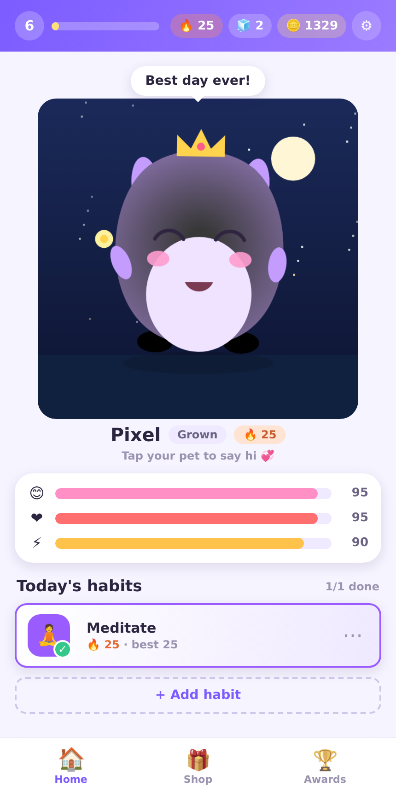

# HabitPet 🐣

A streak tracker you'll actually *want* to open — because there's a little
procedurally-drawn creature whose mood depends on you showing up.

Add habits, check them off each day, and watch your pet thrive and bounce when
you're on top of things — or get sleepy and sad when you neglect them. Keep your
🔥 streaks alive, level up, earn coins, deck your friend out in the shop, and
evolve it from an egg into a fully-grown companion.



## Why it's fun

HabitPet leans on the gamification ideas that actually keep people coming back
(borrowed from Finch, Habitica, Forest & friends) while deliberately avoiding
the shame mechanics that cause burnout:

- **A living pet.** Drawn from scratch on a `<canvas>` — no sprite sheets. It
  breathes, blinks, bounces, blushes, naps, and reacts to your care in real
  time. Its expression is a pure function of its happiness/health/energy.
- **Evolution.** Egg → Blob → Child → Teen → Grown as your longest streak
  grows. Each stage changes the silhouette (ears, arms, feet, size).
- **Streaks, gently.** 🔥 per-habit streaks with milestone payouts. Miss a day
  and a **Streak Freeze** 🧊 quietly protects you — no guilt, no reset shame.
- **An economy.** Earn coins + XP for every check-in. Spend coins in the **Shop**
  on coat colors, hats, scenes (meadow, starry night, beach, deep space) and
  companions (butterfly, firefly).
- **Daily quests** that rotate each day, and **15 achievements** to chase.
- **Stats & a contribution heatmap** so you can see how far you've come.
- **Procedural sound effects** (Web Audio, no assets) and a **reduced-motion**
  option for accessibility.

Everything saves automatically to your browser's `localStorage` — no account,
no backend, no tracking. Your pet lives on your device.

## Run it

You'll need [Node.js](https://nodejs.org) 18+ (tested on 22).

```bash
npm install      # install dependencies
npm run dev      # start the dev server → http://localhost:5173
```

Then open the printed URL in your browser, adopt a pet, and start building
habits. 🥚

### Other commands

```bash
npm run build    # type-check + production build into dist/
npm run preview  # serve the production build locally
npm test         # run the engine unit tests (Vitest)
```

## How it's built

A small, dependency-light **React + TypeScript + Vite** app with a clean split
between *rules* and *rendering*:

```
src/
  game/            ← the pure, framework-free game engine (fully unit-tested)
    types.ts         domain model + persisted GameState
    engine.ts        every rule as a pure state transition (+ emitted events)
    selectors.ts     derived values: streaks, mood, evolution stage, level
    constants.ts     all tuning lives here (rewards, decay, thresholds)
    dates.ts         local-day math
    quests.ts        deterministic daily quest rotation
    achievements.ts  badge predicates
    shop.ts          cosmetic + consumable catalog
    storage.ts       versioned localStorage load/save/migrate
    sound.ts         procedural Web Audio cues
    engine.test.ts   21 tests covering streaks, decay, freezes, economy…
  hooks/
    useGame.ts       binds the engine to React: tick loop, toasts, persistence
  components/
    PetCanvas.tsx    the procedural creature renderer (the fun part)
    …                onboarding, top bar, habits, quests, shop, awards, etc.
  styles/global.css  the cozy design system
```

The engine is the source of truth: it's pure, time-injected, and immutable, so
the rules are deterministic and easy to test. The pet is generated entirely
from canvas primitives, parameterised by evolution stage, mood, vitality and
equipped cosmetics — which is why it can react so fluidly.

Decay is computed from *elapsed real time*, so your pet keeps living while the
tab is closed; reopening catches it up (gently — there's a grace window, and a
full day of neglect only costs about half a bar).

---

Made with 💞 — go keep a streak alive.
